<h1 align="center"> CornWhiRic Co.</h1>

 
 

Company owning an eCommerce website selling grains such as rice, wheat and corn decided to take its sales and marketing to the next level. They hire new business analysts, and marketing & sales experts.The marketing and sales should always be up-to-date in terms of the site's sales performance. They wanted to see the following data at a glance:

> - Top selling product Slow-moving products
> - Total sales for the day
> - Total sales for the month
> - Sales per city
> - Number of site visitors - new customers
> - Number of site visitors - existing customers

 
 
 

## OUTPUTS:

### Desktop view

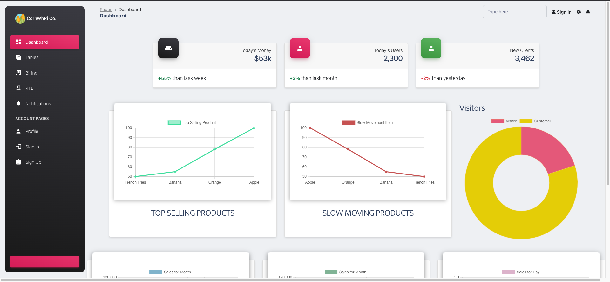
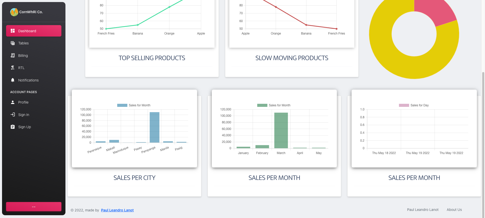

### Mobile view

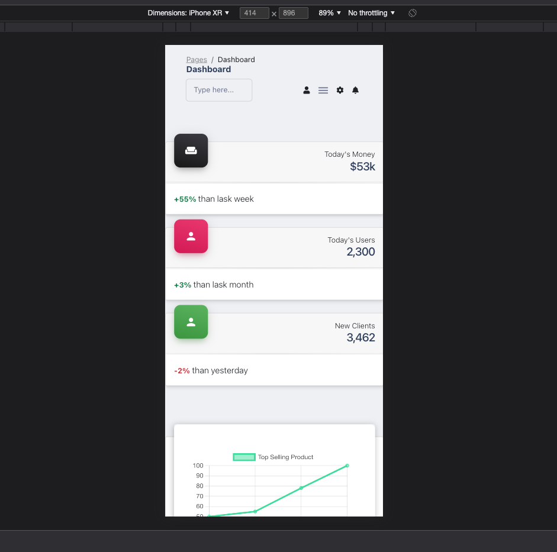
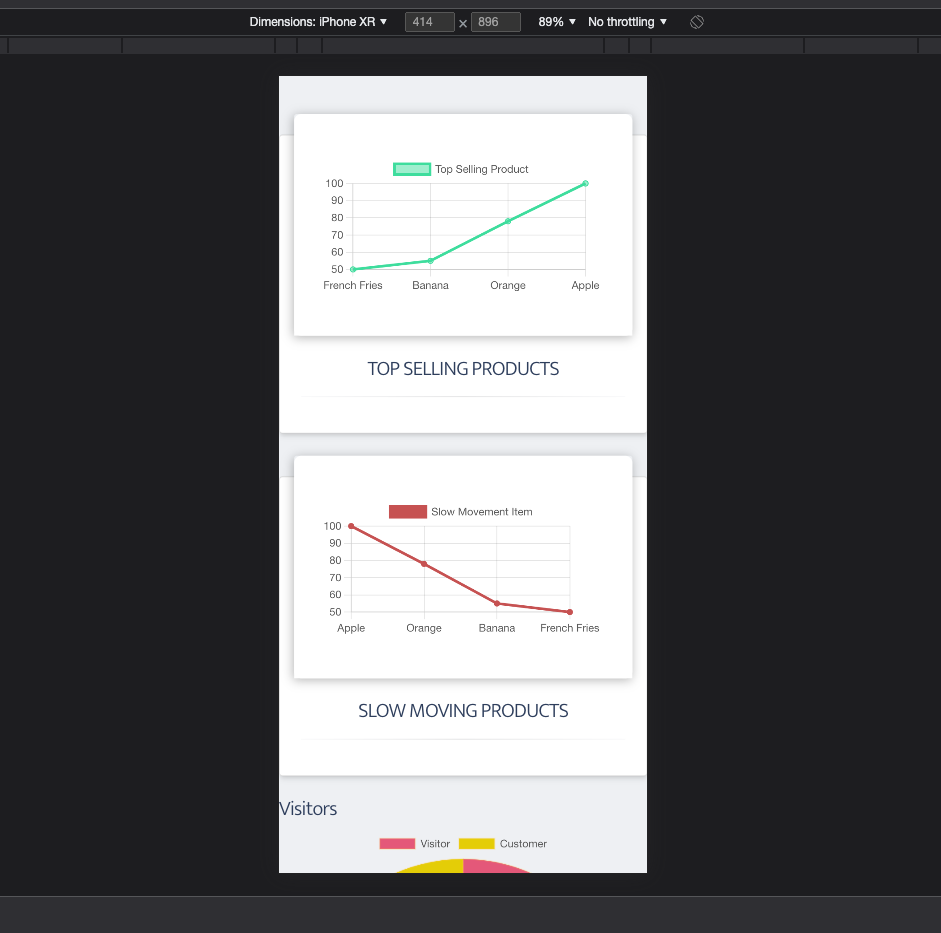
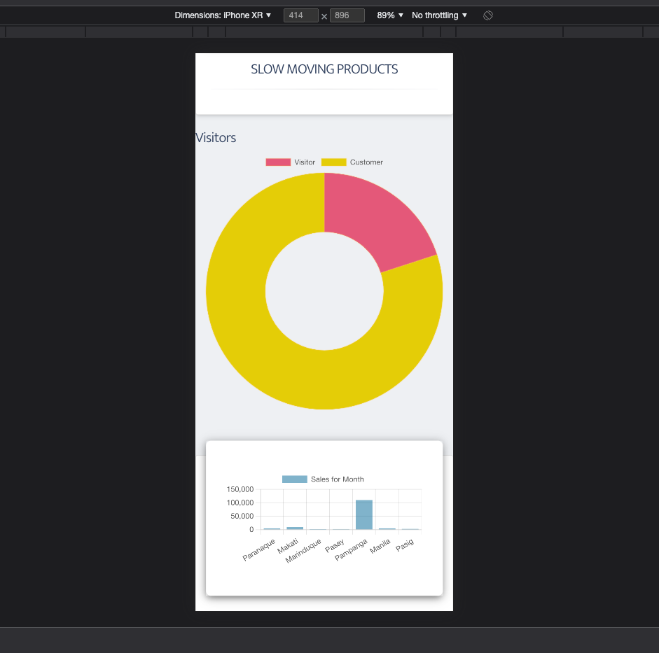
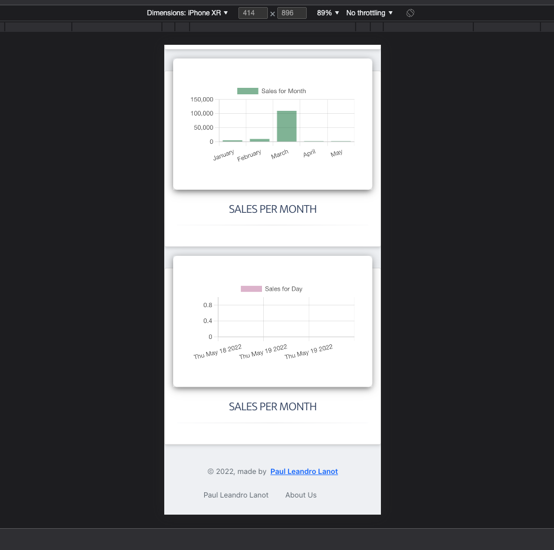

## LIGHTHOUSE RESULTS

### DESKTOP

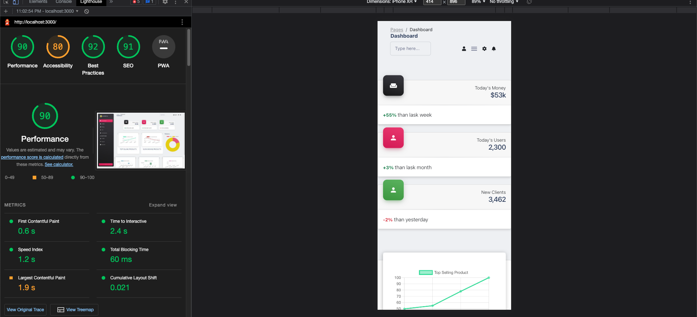

### MOBILE (WORKING ON IT)

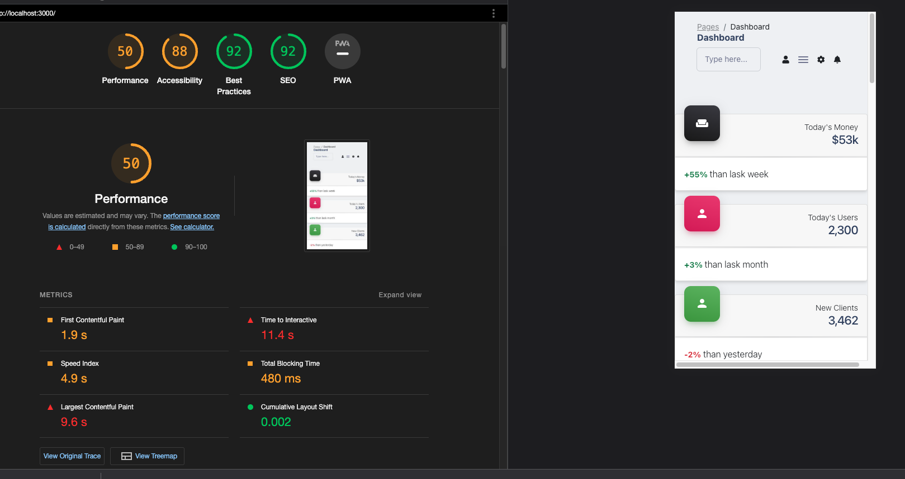

## MISTAKES

- I started at creating a JSON file so that I can test it everytime BUT I figured out that I should have started on creating an object in javascript so that I can have an idea on what should my data would look like in the backend and just convert it into a JSON file after.
- I wasted my time looking for a chart for react and eventually ending up in chartjs
- I started 
## STRUGGLES:

1.  MANIPULATING OBJECTS (Comparing object values)
    
2.  ~~Due to manipulation of object problem I hacked JSON and added an array for sold objects, sales_per_month. (I'm Still working on the algo for the object comparisons)~~

    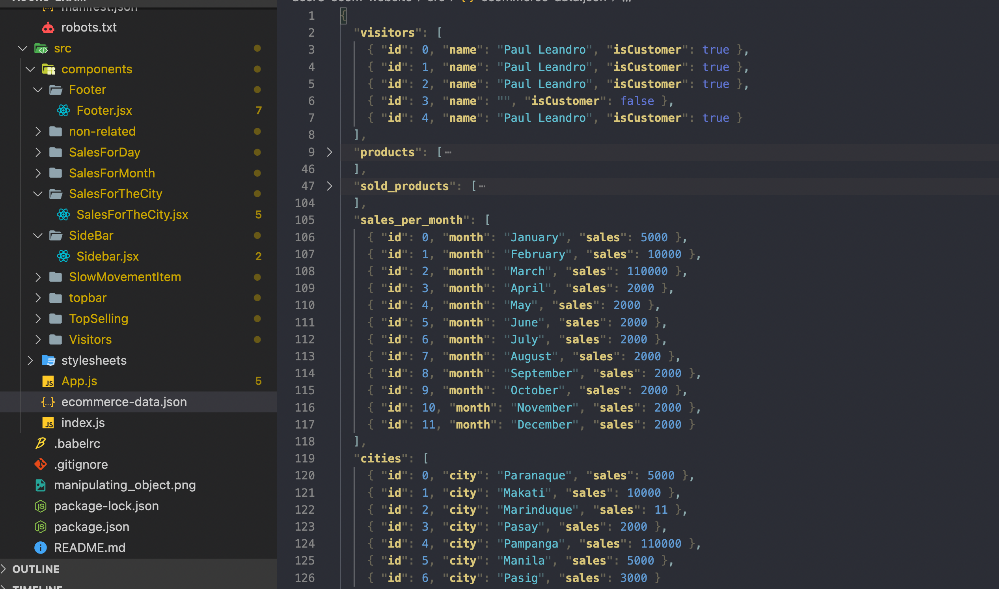

    - DATA MANIPULATION IN JSON SOLVED working on bugs and other components
      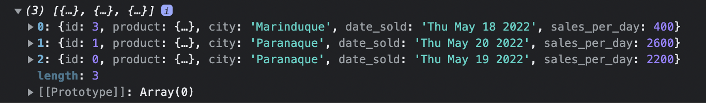
      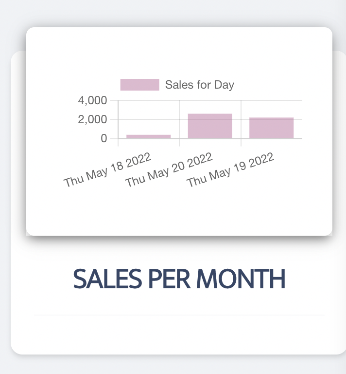

3.  ~~I've downloaded a template for the UI but I will convert it to react component and remove all the assets later. Then install the package of the given CSS framework. (I used my own CSS for other components)~~
    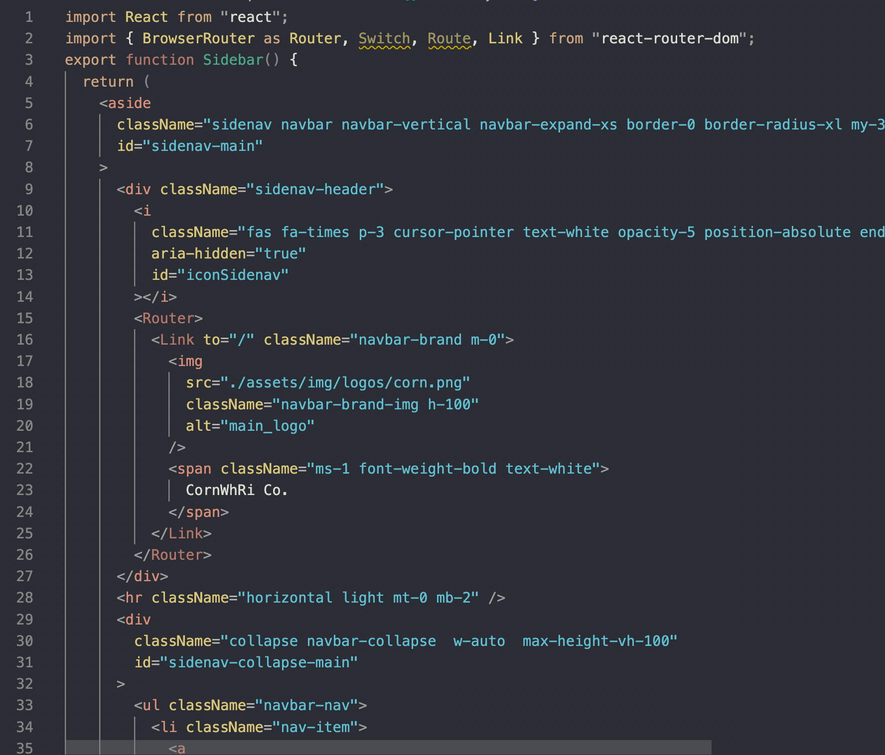
