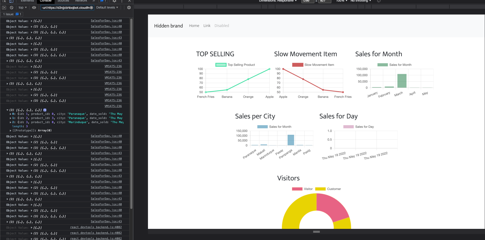

# CornWhiRic Co.

Company owning an eCommerce website selling grains such as rice, wheat and corn decided to take its sales and marketing to the next level. They hire new business analysts, and marketing & sales experts.The marketing and sales should always be up-to-date in terms of the site's sales performance. They wanted to see the following data at a glance:

> - Top selling product Slow-moving products
> - Total sales for the day
> - Total sales for the month
> - Sales per city
> - Number of site visitors - new customers
> - Number of site visitors - existing customers

STRUGGLES:

1.  MANIPULATING OBJECTS (Comparing object values)
    
